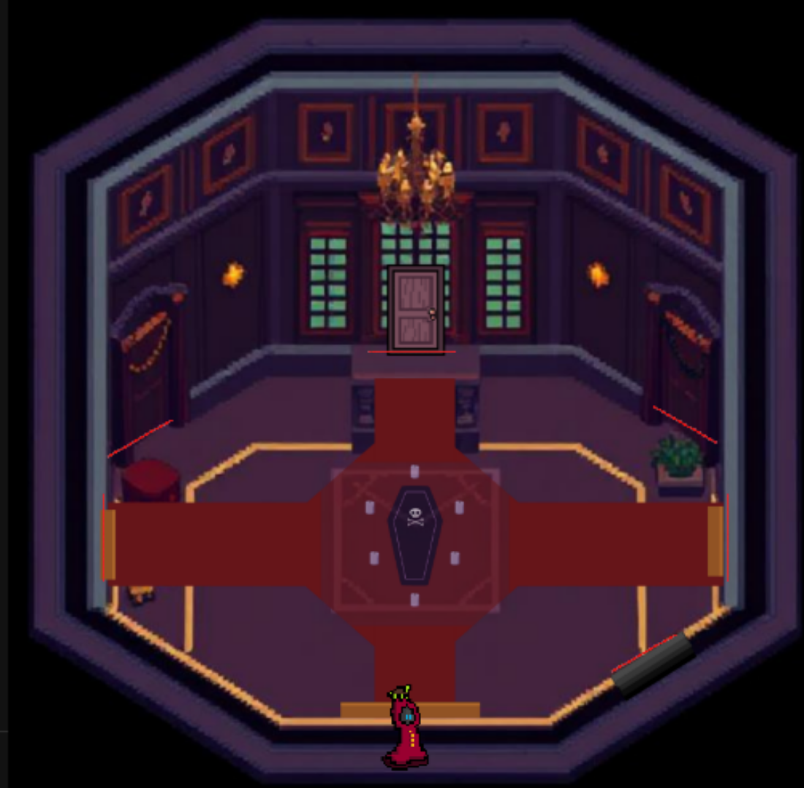
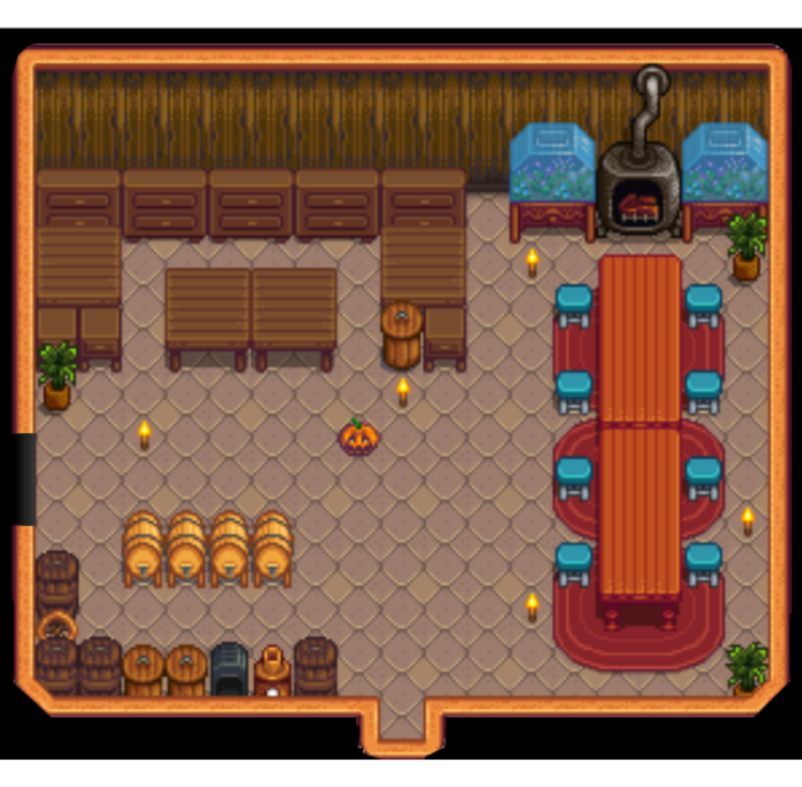
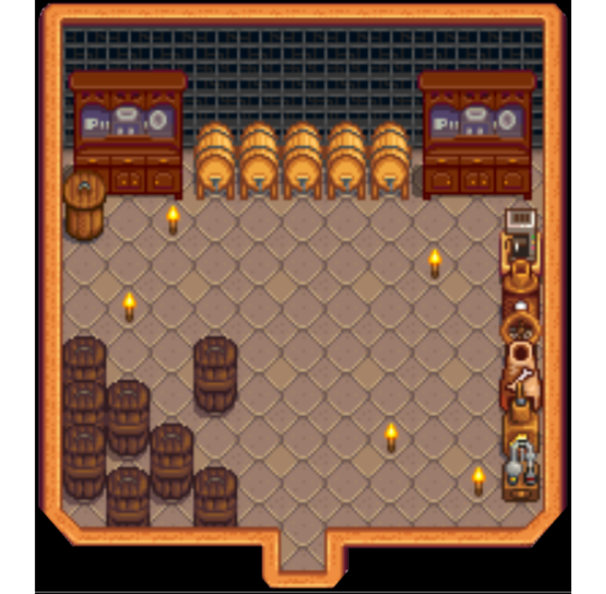
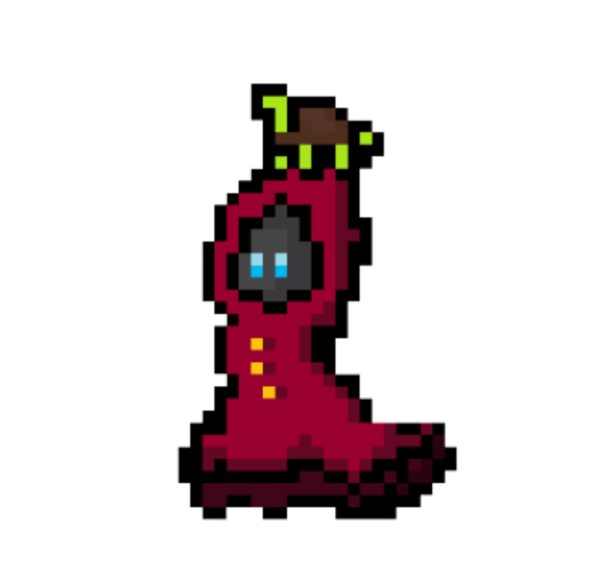
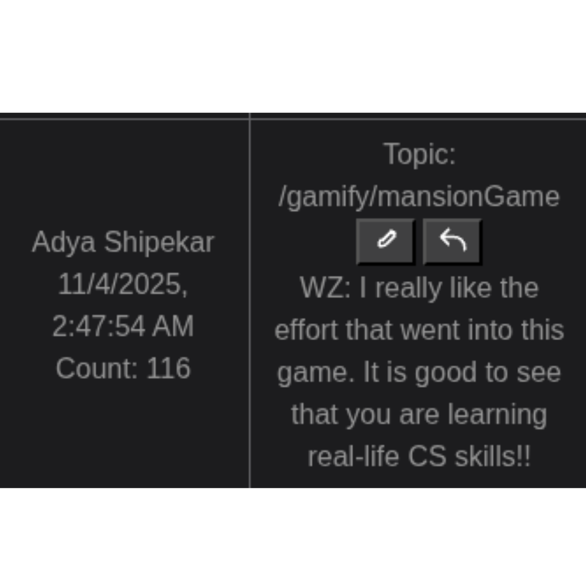
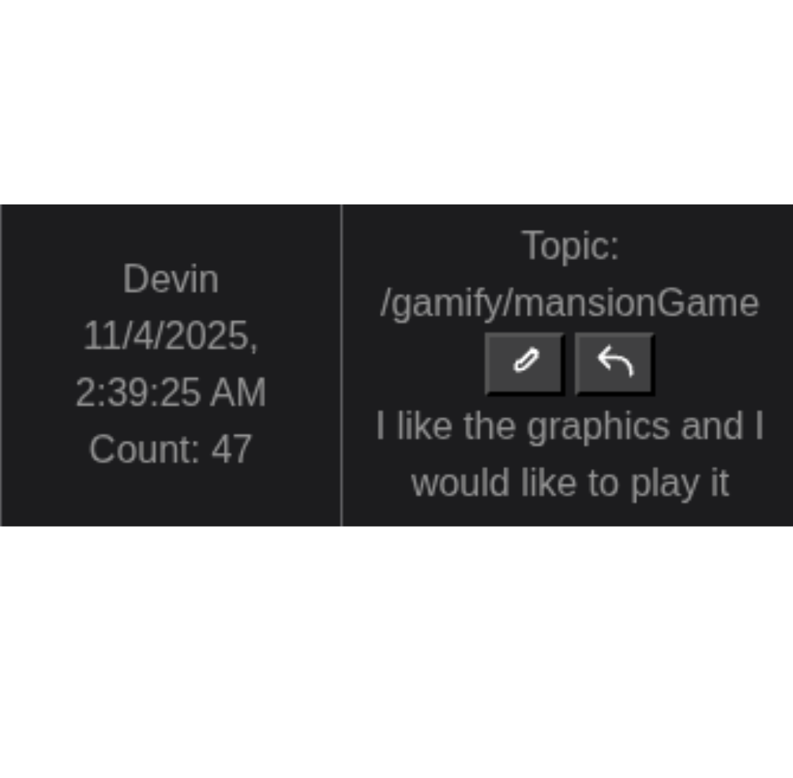
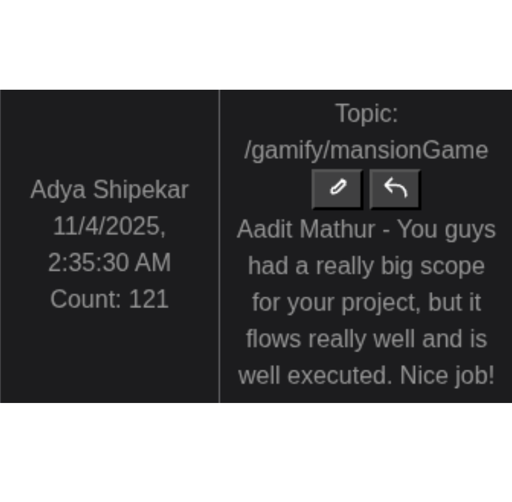
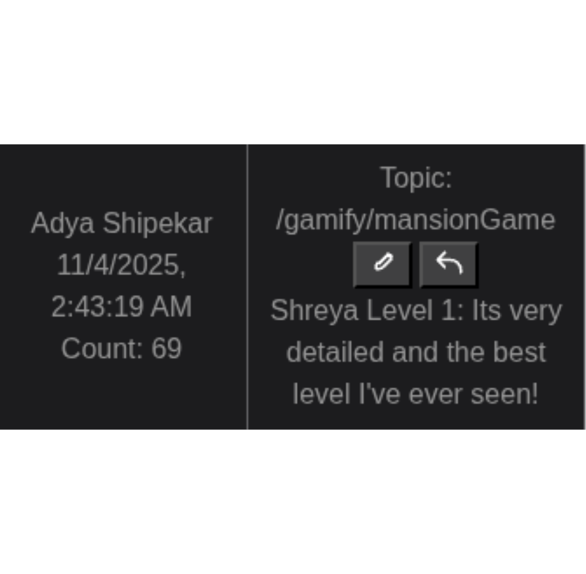
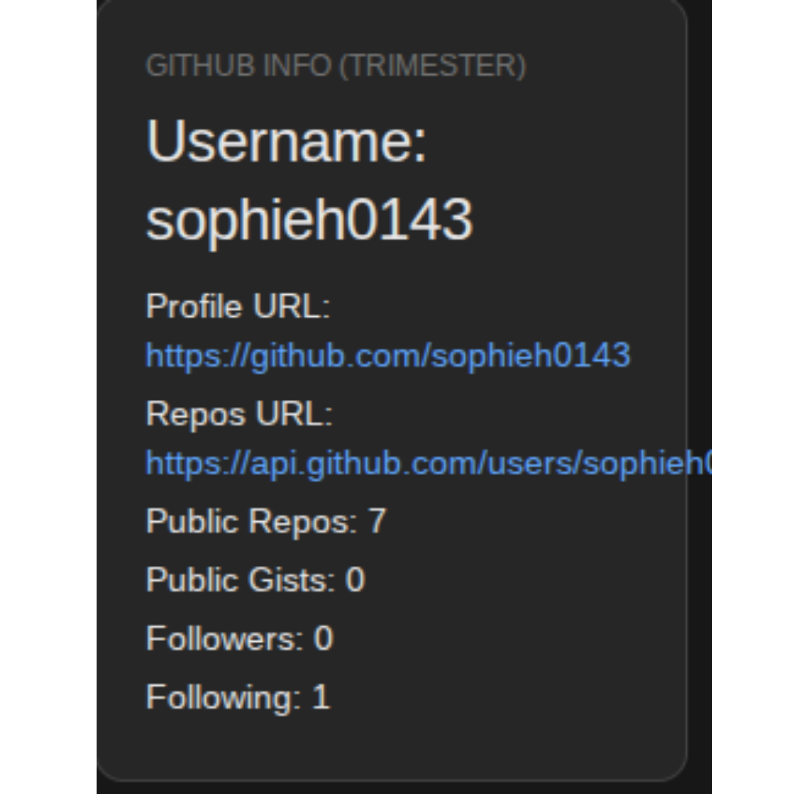
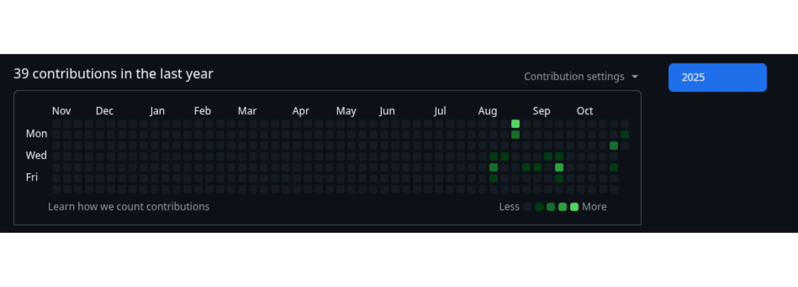

# Game Blog
## Have I Changed?
In the beginning of this trimester, I came into this class very, very stressed. I have worked with some light coding in the past, but it has always frusterated me. 

I hate not knowing how things work, and I get stressed because of that. But latley, in this class, I have learned to deal with stress in a healthy way! If you show up to class, that isn't learning. If you actually give yourself difficult things to solve, albeit some hard things, you can actually learn. 

When you code, it is a lot of trial and error. You code something, then test it. It fails, you go back to troubleshooting. This can be a long, grueling process, but when something works? That feeling is incredible. You can feel so accomplished, and so proud.

An example of one of these moments was when we completed one of our first assignments in this class: About Me blog.

I struggled until the late hours of the night until I completed it. When I finally deployed it on my student repo, I felt so accomplished and happy seeing my final project work.

In this class I have been VERY stressed, but in the long run it was worth the things I learned. 

#### So in short, yes; I think I have changed a lot.

The above image of the chill guy represents how I dealt with stress.

## Key Takeaways

  
 Sprint 1: Tools Setup! 

  
  

    

      
💻

      
Getting Started with GitHub

      

        In the first two weeks of this class, we learned how to open VSCode and Github on our machines. We made our individual Github accounts and learned to create memorable (and complicated!) passwords.
      

    

  

      
📁

      
Repositories & Issues

      

        Our class was taught what a repository and issues were! We spent time making an issue called Chk 1 Panics, because our class was sure to 'panic' in the future, haha. We learned the basics of coding tools that would let us code later in the coming weeks!
      

    

  

      
⌨️

      
Terminal Commands

      

        After creating a KASM account (I use Ubuntu Noble), we opened our repositories using our terminals! In our terminals, we learned simple commands like make, source venv/bin/activate, and code .! We also learned that we need to commit our changes to Github, which acts as the VS CODE 'save' button!
      

    

  

      
🐍

      
Virtual Environments (The Struggle!)

      

        Creating a virtual environment was an issue that took me a while to resolve, because my machine had around thirteen venvs (which stands for virtual environment) at once. I still don't understand how that's possible! 😅 We also learned to troubleshoot!
      

    

  

      
📓

      
Jupyter Notebooks & Markdown

      

        Next, we learned how to open Jupyter notebooks as well as create an .md file! We also learned to create .ipynb files, which can write and execute code in individual "cells" within the notebook, and immediately see the output.
      

    

  

#### Sprint 2: Javascript Fundamentals Hacks + Homeworks

Using our basic coding knowledge and new tools, we started to create and mimic games known as 'hacks'. These hacks helped to teach us Javascript Fundamentals! Our team created hacks together, such as Snake Game, OOP Breakout, and a Calculator! You can find all of these games in our team's website that we created to house all of our games/lessons we made. The link is below! 

https://adyashipekar.github.io/code-constellations/ 

On that website, feel free to explore! After our hacks we started to create lessons to teach our own class. Each team in class created their own lesson along with assigned homework, and each team (there are 6 teams) would present at an assigned time! These lessons helped me learn more about Javascript Fundamentals such as: 
- Variables
- Conditionals
- Arrays
- Strings
- Booleans
- Math Expressions
- Iterations
- Functions
- Classes/Methods

An example of a lesson our team presented was Conditionals!

### Below is an example of one of my team's hacks: The Calculator! We spent time creating loops and arrays for this to work

<!-- Add a container for the animation -->

 

     <!--result-->
     
0

     <!--row 1-->
     
1

     
2

     
3

     <!--row 2-->
     
+

     
4

     
5

     
6

     
-

     <!--row 3-->
     
7

     
8

     
9

     
*

     <!--row 4-->
     
A/C

     
0

     
.

     
=

 

<!-- JavaScript (JS) implementation of the calculator. -->

<!-- Vanta animations -->

## SPRINT 3: QUEST OF SPOOK GAME IMAGES
These are the levels/places my group, the Constellators, was responsble for! We designed and coded the Parlor (the main world) as well as the Kitchen/Pantry! The Kitchen/Pantry is Level 1. Our group was also responsible for overseeing the project!

  
  
  
  

On the above left, you can see the main character (sprite) that was used for our game!

## His name is Spook, the Ghosthunter.

### This entire project took a LOT of work. We spent many long hours troubleshooting, communicating, and stressing out! We learned many new coding skills, such as using LOTS of conditionals for the interactive buttons in our level. Collision detection was also a big hurdle our team got over. 

Overall, I am happy how the game turned out! I was the main designer for our level, and I used pixel art to create all the background! Another person from another team, Arush Bandi, was responsible for creating all of the sprites from Pixel art!

# Night At The Museuem! (our final)
I thought this would have been an event at a much smaller scale, but I was genuinely surprised by the number of people who arrived! Arriving at 6:00, my team and I got to practice our presentation and observe the other Computer Science class present their own games! We were very impressed. When it was our turn to present, I felt very nervous but excited! Everyone seemed to love our game, and we recieved a great amount of positive feedback! The worst critisim our teamed recieved was to talk louder! 
### Below are some images of some of my favorite comments!

  

    
    
    
    
  

  
  <button class="carousel-btn prev" onclick="moveCarousel(-1)">❮</button>
  <button class="carousel-btn next" onclick="moveCarousel(1)">❯</button>
  
  

    
    
    
    
  

  
## What do you want to do next on project, given time?
In the future,

// What do you want to learn next in Compsci?

## Analytics reveiw
Over the course of this trimester I have many contributions to my projects, group efforts, and other things! I think the Open Coding Soceity dashboard could use slight work on the API system and tracking student's individual progress, becuase some of the information isn't accurate. 

I have made WAY more than 18 commits! On my Github, which is much more accurate, you can see I have more than 80 commits on my student alone. I've had to use a LOT of trial and error...

 On Github.com, you can veiw my contributions as well as an awesome system on OpenCodingSoceity.com! This was created by students to make our experience even better! 
- Link to Open Coding Society --> https://pages.opencodingsociety.com/dashboard
- Link to my Github page! --> https://github.com/sophieh0143 

Here are some images!

  
  
  

## Our Group
